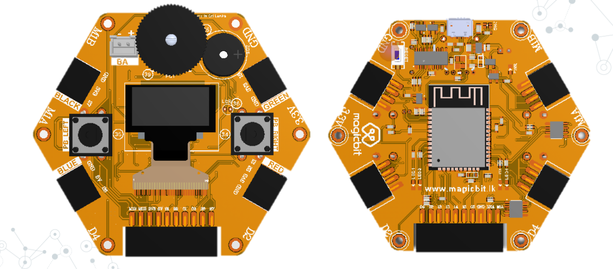

# Arduino core for the Magicbit
Forked from [espressif/arduino-esp32](https://github.com/espressif/arduino-esp32)

### Installation Instructions
- Install the current upstream Arduino IDE at the 1.8 level or later. The current version is at the [Arduino website](http://www.arduino.cc/en/main/software).
- Start Arduino and open Preferences window.
- Enter one of the release links above into Additional Board Manager URLs field. You can add multiple URLs, separating them with commas.
- Open Boards Manager from Tools > Board menu and install magicbit platform (and don't forget to select Magicbit from Tools > Board menu after installation).

### Magicbit Board PINMAP

### Tip

